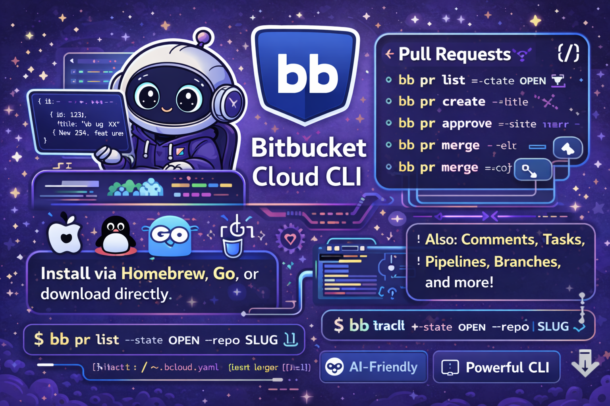

[](LICENSE)
[](go.mod)
[](https://goreportcard.com/report/github.com/payfacto/bb)

# bb — Bitbucket Cloud CLI

A Go CLI for the Bitbucket Cloud REST API v2.0. Designed AI agent consumption, but humans can use it too!

> **Disclaimer:** `bb` is an unofficial tool and is not affiliated with or endorsed by Atlassian or Bitbucket.

## Install

```bash
# From source
go install github.com/payfacto/bb@latest

# Build locally
go build -o bb .
```

## Quick Start

```bash
bb setup                    # interactive config wizard
bb pr list                  # list open PRs in configured repo
bb pr get --pr-id 42        # get a specific PR as JSON
bb pr list --format text    # human-readable output
```

## Authentication

Create `~/.bbcloud.yaml`:

```yaml
workspace: your-workspace-slug
repo: your-repo-slug
username: your-bitbucket-username
token: your-app-password
```

Or use environment variables: `BITBUCKET_USER`, `BITBUCKET_TOKEN`

Or pass flags: `--username`, `--token`, `--workspace`, `--repo`

**Precedence (lowest → highest):** config file → env vars → CLI flags

## Global Flags

| Flag | Description |
|------|-------------|
| `--workspace SLUG` | Bitbucket workspace slug |
| `--repo SLUG` | Repository slug |
| `--format json\|text` | Output format (default: `json`) |
| `--config PATH` | Path to config file (default: `~/.bbcloud.yaml`) |

## Commands

### Pull Requests

```
bb pr list [--state OPEN|MERGED|DECLINED|SUPERSEDED]
bb pr get --pr-id ID
bb pr create --title "..." --from-branch BRANCH --to-branch BRANCH [--description "..."] [--close-source-branch]
bb pr diff --pr-id ID
bb pr approve --pr-id ID
bb pr merge --pr-id ID [--strategy merge_commit|squash|fast_forward]
bb pr decline --pr-id ID
bb pr activity --pr-id ID
bb pr statuses --pr-id ID
```

### PR Comments

```
bb comment list --pr-id ID
bb comment add --pr-id ID --body "..."
bb comment reply --pr-id ID --comment-id ID --body "..."
```

### PR Tasks

```
bb task list --pr-id ID
bb task complete --task-id ID --pr-id ID
bb task reopen --task-id ID --pr-id ID
```

### Pipelines

```
bb pipeline list
bb pipeline get --pipeline-uuid UUID
bb pipeline trigger --branch BRANCH
bb pipeline stop --pipeline-uuid UUID
bb pipeline steps --pipeline-uuid UUID
bb pipeline log --pipeline-uuid UUID --step-uuid UUID
```

### Branches

```
bb branch list
bb branch get --name BRANCH
bb branch create --name BRANCH --target COMMIT_OR_BRANCH
bb branch delete --name BRANCH
```

### Tags

```
bb tag list
bb tag get --name TAG
bb tag create --name TAG --target COMMIT
bb tag delete --name TAG
```

### Commits

```
bb commit list [--branch BRANCH]
bb commit get --hash HASH
bb commit file --hash HASH --path PATH
```

### Repositories

```
bb repo list
```

### Issues

```
bb issue list
bb issue get --issue-id ID
bb issue create --title "..." [--content "..."] [--kind bug|enhancement|proposal|task] [--priority trivial|minor|major|critical|blocker]
```

### Deployments & Environments

```
bb deployment list [--env-uuid UUID]
bb env list
bb env get --env-uuid UUID
```

### Members & Users

```
bb member list
bb user me
bb user get --account-id ID
```

### Webhooks

```
bb webhook list
bb webhook create --url URL --events EVENT,EVENT [--description "..."] [--active]
bb webhook delete --webhook-id ID
```

### Deploy Keys

```
bb deploy-key list
bb deploy-key create --key "ssh-rsa ..." --label "..."
bb deploy-key delete --key-id ID
```

### Branch Restrictions

```
bb restriction list
bb restriction create --kind KIND --pattern PATTERN [--branch-match-kind glob|branching_model]
bb restriction delete --restriction-id ID
```

### Downloads

```
bb download list
bb download file --filename NAME --dest PATH
bb download upload --file PATH
```

## Output

Default output is JSON (machine-readable, suitable for `jq`). Pass `--format text` for human-readable plain text.

`bb pr diff` and `bb pipeline log` always output plain text regardless of `--format`.

Errors are written to stderr with a non-zero exit code.

## For AI Agents

See [`llms.txt`](llms.txt) for a compact machine-readable reference.

Key notes:
- All list commands return JSON arrays; single-resource commands return a JSON object.
- IDs are integers for PRs, tasks, and issues. UUIDs (with `{}` braces) for pipelines, steps, and environments.
- `workspace` and `repo` can be omitted from flags if set in `~/.bbcloud.yaml`.
- The CLI exits non-zero on API errors and prints the error to stderr.

## Development

```bash
go build -o bb .       # build
go test ./...          # run all tests
go test ./pkg/bitbucket/  # client tests only
```

Tests use `net/http/httptest` — no external API calls required.
